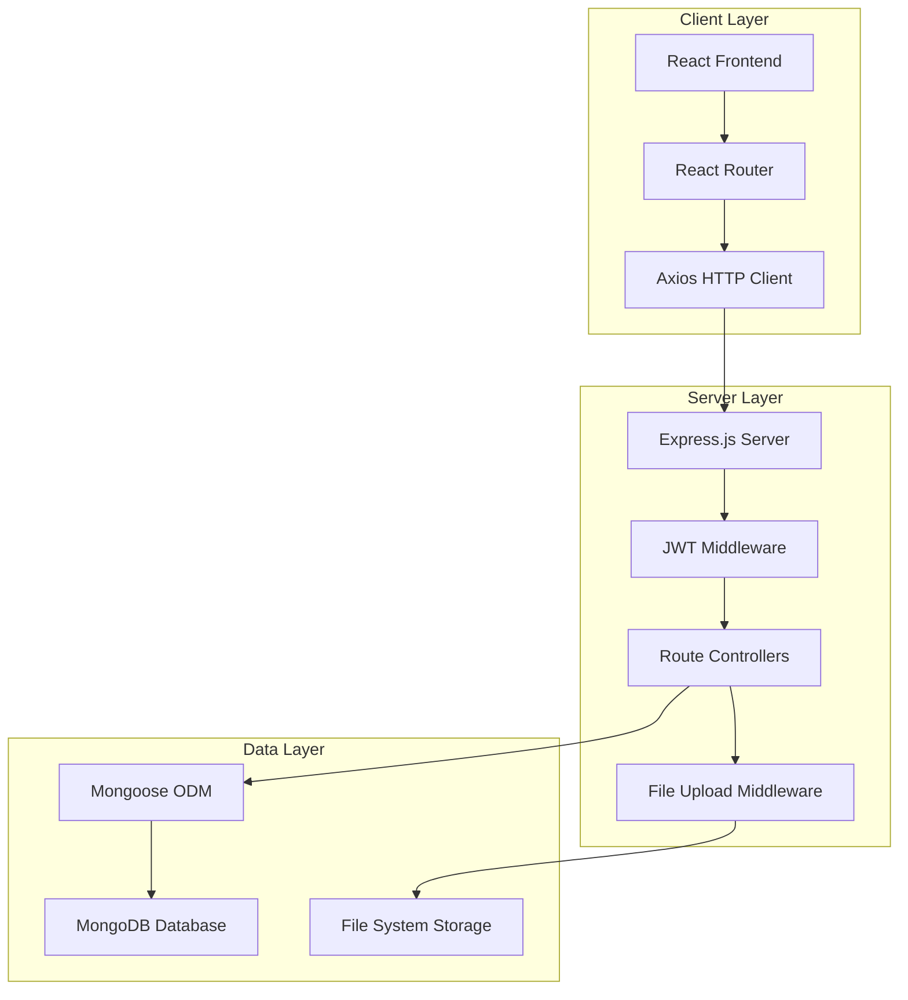

# Design Document

## Overview

The Student Portal System is a full-stack web application built using the MERN stack (MongoDB, Express.js, React, Node.js) that provides a comprehensive educational management platform. The system implements role-based access control with three distinct user types: Students, Teachers, and Administrators. The architecture follows RESTful API principles with JWT-based authentication and supports file uploads for course materials and assignments.

## Architecture

### High-Level Architecture



### Technology Stack

- **Frontend**: React 19 with functional components, React Router v7, Axios, Context API
- **Backend**: Node.js with Express.js, JWT authentication, bcryptjs for password hashing
- **Database**: MongoDB with Mongoose ODM
- **File Storage**: Local file system with Multer middleware
- **Development**: Vite for frontend bundling, Nodemon for backend development

## Components and Interfaces

### Frontend Components

#### Authentication Components
- **LoginForm**: Handles user authentication with role-based redirects
- **RegisterForm**: User registration with role selection (Student/Teacher only)
- **ProtectedRoute**: Route wrapper that enforces authentication and role-based access

#### Dashboard Components
- **StudentDashboard**: Displays enrolled courses, assignments, grades, and announcements
- **TeacherDashboard**: Shows managed courses, student submissions, and grading interface
- **AdminDashboard**: Provides user management, course oversight, and system analytics

#### Course Management Components
- **CourseList**: Displays available courses with enrollment options
- **CourseDetail**: Shows course information, materials, assignments, and announcements
- **CourseForm**: Create/edit course interface for teachers and admins
- **EnrollmentManager**: Handles student enrollment and course access

#### Assignment Components
- **AssignmentList**: Displays assignments with due dates and submission status
- **AssignmentDetail**: Shows assignment requirements and submission interface
- **AssignmentForm**: Create/edit assignments with file upload support
- **SubmissionViewer**: Interface for viewing and grading student submissions

#### File Management Components
- **FileUpload**: Reusable component for handling file uploads
- **FileViewer**: Display and download interface for course materials and submissions
- **FileManager**: Administrative interface for managing uploaded files

### Backend API Endpoints

#### Authentication Routes (`/api/auth`)
- `POST /register` - User registration
- `POST /login` - User authentication
- `GET /profile` - Get current user profile
- `PUT /profile` - Update user profile

#### User Management Routes (`/api/users`)
- `GET /` - List all users (Admin only)
- `GET /:id` - Get specific user details
- `PUT /:id` - Update user information
- `DELETE /:id` - Delete user account (Admin only)

#### Course Routes (`/api/courses`)
- `GET /` - List all courses
- `POST /` - Create new course (Teacher/Admin)
- `GET /:id` - Get course details
- `PUT /:id` - Update course information
- `DELETE /:id` - Delete course
- `POST /:id/enroll` - Enroll student in course
- `DELETE /:id/enroll` - Unenroll student from course

#### Assignment Routes (`/api/assignments`)
- `GET /course/:courseId` - Get assignments for a course
- `POST /` - Create new assignment (Teacher/Admin)
- `GET /:id` - Get assignment details
- `PUT /:id` - Update assignment
- `DELETE /:id` - Delete assignment
- `POST /:id/submit` - Submit assignment (Student)
- `GET /:id/submissions` - Get all submissions (Teacher/Admin)
- `PUT /submission/:id/grade` - Grade submission (Teacher/Admin)

#### Announcement Routes (`/api/announcements`)
- `GET /` - Get global announcements
- `POST /` - Create global announcement (Admin only)
- `GET /course/:courseId` - Get course announcements
- `POST /course/:courseId` - Create course announcement (Teacher/Admin)
- `PUT /:id` - Update announcement
- `DELETE /:id` - Delete announcement

#### File Routes (`/api/files`)
- `POST /upload` - Upload file with validation
- `GET /:id` - Download/view file
- `DELETE /:id` - Delete file (Owner/Admin only)

## Data Models

### User Model
```javascript
{
  _id: ObjectId,
  name: String (required),
  email: String (required, unique),
  password: String (required, hashed),
  role: String (enum: ['Student', 'Teacher', 'Admin']),
  studentId: String (optional, for students),
  teacherCredentials: String (optional, for teachers),
  enrolledCourses: [ObjectId] (references Course),
  createdAt: Date,
  updatedAt: Date
}
```

### Course Model
```javascript
{
  _id: ObjectId,
  name: String (required),
  description: String (required),
  subject: String (required),
  teacher: ObjectId (reference to User),
  enrolledStudents: [ObjectId] (references User),
  materials: [{
    name: String,
    fileId: ObjectId,
    uploadDate: Date
  }],
  isActive: Boolean (default: true),
  createdAt: Date,
  updatedAt: Date
}
```

### Assignment Model
```javascript
{
  _id: ObjectId,
  title: String (required),
  description: String (required),
  course: ObjectId (reference to Course),
  dueDate: Date (required),
  pointValue: Number (required),
  attachments: [{
    name: String,
    fileId: ObjectId
  }],
  isActive: Boolean (default: true),
  createdAt: Date,
  updatedAt: Date
}
```

### Submission Model
```javascript
{
  _id: ObjectId,
  assignment: ObjectId (reference to Assignment),
  student: ObjectId (reference to User),
  submissionText: String,
  attachments: [{
    name: String,
    fileId: ObjectId
  }],
  submittedAt: Date,
  isLate: Boolean,
  grade: Number,
  feedback: String,
  gradedAt: Date,
  gradedBy: ObjectId (reference to User)
}
```

### Announcement Model
```javascript
{
  _id: ObjectId,
  title: String (required),
  content: String (required),
  author: ObjectId (reference to User),
  course: ObjectId (optional, reference to Course),
  isGlobal: Boolean (default: false),
  isActive: Boolean (default: true),
  createdAt: Date,
  updatedAt: Date
}
```

### File Model
```javascript
{
  _id: ObjectId,
  originalName: String (required),
  filename: String (required),
  mimetype: String (required),
  size: Number (required),
  path: String (required),
  uploadedBy: ObjectId (reference to User),
  uploadedAt: Date
}
```

## Error Handling

### Frontend Error Handling
- **API Error Interceptor**: Axios interceptor to handle HTTP errors and token expiration
- **Error Boundary**: React error boundary to catch and display component errors
- **Form Validation**: Client-side validation with user-friendly error messages
- **Loading States**: Loading indicators for async operations

### Backend Error Handling
- **Global Error Middleware**: Centralized error handling for all routes
- **Validation Errors**: Mongoose validation error handling with detailed messages
- **Authentication Errors**: JWT token validation and expiration handling
- **File Upload Errors**: File type, size, and storage error handling
- **Database Errors**: MongoDB connection and operation error handling

### Error Response Format
```javascript
{
  success: false,
  error: {
    message: "User-friendly error message",
    code: "ERROR_CODE",
    details: {} // Additional error details for debugging
  }
}
```

## Testing Strategy

### Frontend Testing
- **Unit Tests**: Jest and React Testing Library for component testing
- **Integration Tests**: Testing component interactions and API calls
- **E2E Tests**: Cypress for end-to-end user workflow testing
- **Accessibility Tests**: Automated accessibility testing with axe-core

### Backend Testing
- **Unit Tests**: Jest for testing individual functions and middleware
- **Integration Tests**: Supertest for API endpoint testing
- **Database Tests**: MongoDB Memory Server for isolated database testing
- **Authentication Tests**: JWT token generation and validation testing

### Test Coverage Goals
- **Frontend**: 80% code coverage for components and utilities
- **Backend**: 90% code coverage for controllers, models, and middleware
- **API Tests**: 100% coverage of all API endpoints
- **E2E Tests**: Critical user workflows (login, course enrollment, assignment submission)

### Testing Environment
- **Test Database**: Separate MongoDB instance for testing
- **Mock Services**: Mock external services and file operations
- **Test Data**: Seed data for consistent testing scenarios
- **CI/CD Integration**: Automated testing in GitHub Actions or similar

## Security Considerations

### Authentication & Authorization
- **JWT Tokens**: Secure token generation with expiration
- **Password Hashing**: bcryptjs with salt rounds for password security
- **Role-Based Access**: Middleware to enforce role-based permissions
- **Session Management**: Token refresh and logout functionality

### Data Protection
- **Input Validation**: Server-side validation for all user inputs
- **SQL Injection Prevention**: Mongoose ODM provides built-in protection
- **XSS Prevention**: Input sanitization and output encoding
- **CORS Configuration**: Proper cross-origin resource sharing setup

### File Security
- **File Type Validation**: Whitelist of allowed file types
- **File Size Limits**: Maximum file size restrictions
- **Virus Scanning**: Integration with antivirus scanning for uploads
- **Secure File Storage**: Files stored outside web root with access controls

### API Security
- **Rate Limiting**: Prevent API abuse with request rate limiting
- **HTTPS Enforcement**: SSL/TLS encryption for all communications
- **API Versioning**: Structured API versioning for backward compatibility
- **Audit Logging**: Comprehensive logging of user actions and system events